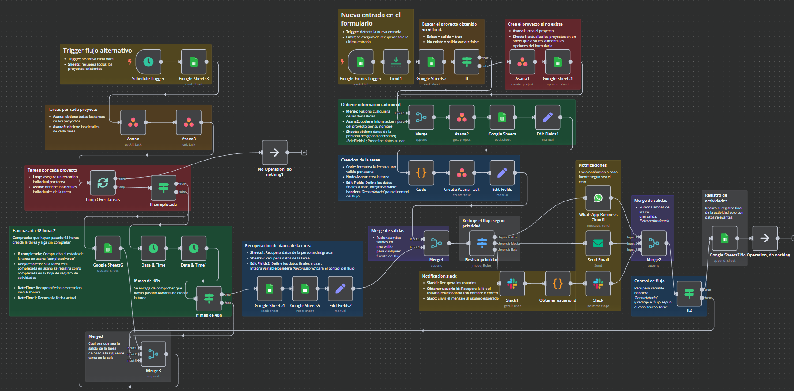

# Sistema Integrado de Gestión de Tareas y Notificaciones

Este flujo de trabajo en **n8n** automatiza la asignación de tareas, seguimiento de pendientes y envío de notificaciones en múltiples plataformas como **Slack, WhatsApp y Email**. También registra y actualiza datos en **Google Sheets y Asana**.



## Descripción

El sistema permite gestionar tareas de manera eficiente a través de la integración con:
- **Google Forms**: Recibe tareas mediante un formulario.
- **Google Sheets**: Almacena datos de tareas proyectos.
- **Asana**: Crea y gestiona tareas automáticamente.
- **Slack, WhatsApp & Email**: Notifica asignaciones a los responsables.


## Flujo de Trabajo

Las tareas se capturan a través de un formulario de Google que solicita los siguientes campos:  
 
- **Nombre de la tarea**  
- **Nivel de urgencia**  
- **Descripción de la tarea**  
- **Proyecto involucrado**  
- **Persona designada**  
- **Fecha límite**  
- **Hora límite (24H)**  

Los campos de **Proyecto involucrado** y **Persona designada** utilizan datos provenientes de hojas de Google mediante triggers usando [Apps Script](./scripts-appscript
):  

- **Proyecto involucrado**: Carga opciones desde otra hoja que enumera los proyectos creados en Asana. Es necesario añadir al menos un proyecto manualmente, y se puede crear un nuevo proyecto directamente desde el formulario si se elige la opción "Otro".
[Script necesario](./scripts-appscript/proyectos)  
  
- **Persona designada**: Se presenta como un menú desplegable que carga nombres de miembros desde una hoja de Google que almacena los datos de nombre, correo y teléfono. Es imprescindible que los nombres se correspondan con las cuentas de los miembros en Asana y Slack además deben ser cargados manualmente(se podría automatizar).  

### Proceso de Gestión de Tareas  

Cuando se recibe una nueva entrada en el formulario, se activa un **trigger** en n8n que sigue estos pasos:  

1. **Verificación del Proyecto**: Se consulta la hoja de proyectos para comprobar si el proyecto ya está registrado. Si no lo está, se crea un nuevo proyecto.  
2. **Creación de Tarea**: Con los datos del formulario, se crea una tarea en Asana.  
3. **Notificación de Asignación**: Según el nivel de urgencia definido en el formulario:  
   - **Alta**: Notificación a través de WhatsApp.  
   - **Media**: Notificación por correo electrónico.  
   - **Baja**: Notificación por Slack.  
4. **Registro de Interacción**: Se guarda la interacción con los datos de la tarea (ID en Asana, estado, persona asignada, fecha y hora límite) en un formulario de registro.  

### Flujo Alternativo: Monitoreo de Tareas  

Dentro del mismo flujo, hay un trigger de tiempo que se ejecuta cada hora para monitorear las tareas registradas. Este proceso realiza lo siguiente:  

1. **Verificación de Tareas**: Se obtiene una lista de todas las tareas por proyecto.  
2. **Recorrido de Tareas**: Se utiliza un nodo de bucle para examinar cada tarea:  
   - Si la tarea está completada, se marca como completada en la hoja de interacciones.  
   - Si no está completada y ha pasado más de 48 horas desde su creación, se verifica su urgencia para enviar un recordatorio.  
3. **Notificación de Recordatorio**: Si la tarea no ha sido completada y ha pasado el umbral de 48 horas, se envía un recordatorio a la persona asignada.  


---

## **Requisitos Previos**
- **n8n**: Instancia local (Docker) o en **n8n Cloud**.
- **Cuentas y credenciales**:
  - Google Sheets API (para almacenar y recuperar datos).
    - Formulario con los campos *recomendados*:'Nombre de la tarea:', 'Nivel de urgencia', 'Descripción de la tarea:', 'Proyecto involucrado: (tipo opciones)', 'Persona designada:(tipo lista desplegable)', 'Fecha limite' y	'Hora limite(24H)'.
    - Hoja de calculo (para almacenar informacion de los **miembros** para usar en asana/slack/whatsapp) con los campos *recomendados*: 'NOMBRE', 'CORREO' y 'Telefono'.
    - Hoja de calculo (para almacenar informacion de los **proyectos** de asana) con los campos *recomendados*: 'Nombre' y 'ID'
    - Hoja de calculo (para almacenar las interacciones) con los campos *recomendados*: 'ID EN ASANA', 'TAREA', 'DESCRIPCION', 'PROYECTO', 'PRIORIDAD', 'PERSONA DESIGNADA', 'FECHA LIMITE' y 'ESTADO'.
  - Google Apps Script (para automatizar las opciones en el formulario de registro de tareas)
  - Asana API (para gestión de tareas y proyectos).
  - Slack API (para enviar notificaciones).
  - WhatsApp API (para alertas en WhatsApp Business).
  - SMTP (para enviar correos electrónicos).
- **Node.js**: Para ejecutar n8n localmente (si no usas Docker).

### Instalación con Docker:
```bash
docker run -it --rm --name n8n -p 5678:5678 -v n8n_data:/home/node/.n8n docker.n8n.io/n8nio/n8n
```
Lanzar online con  **ngrok**
```bash
ngrok config add-authtoken <<PonAquiTuAuthtoken>>
ngrok http http://localhost:5678
```
# Estructura del proyecto

│── /scripts-appscript/  *Códigos de Google Apps Script*

│  ├── cargarOpcionesFormulario1.gs

│  ├── cargarOpcionesFormulario2.gs

│  ├── README.md

│── workflow.json  *JSON del workflow principal*

│── README.md  *Este archivo*

# Uso
Copia el archivo workflow.json.
En n8n UI (http://localhost:5678), ve a "Workflows" > "Import from File" y pega el JSON.
Configura las credenciales en "Credentials".

# Limitaciones
- Dependencia de APIs Externas: Google Sheets, Asana, Slack y WhatsApp deben estar operativos.
- Control de Errores: Se recomienda agregar más manejo de errores en caso de fallos en la API.
- Escalabilidad: Para grandes volúmenes de tareas, se puede optimizar con base de datos.

# Contribuciones
¡Las contribuciones son bienvenidas! Por favor, abre un issue o un pull request en este repositorio.

# Autores
Apolo Reynoso Ruíz - Erick González Gómez
